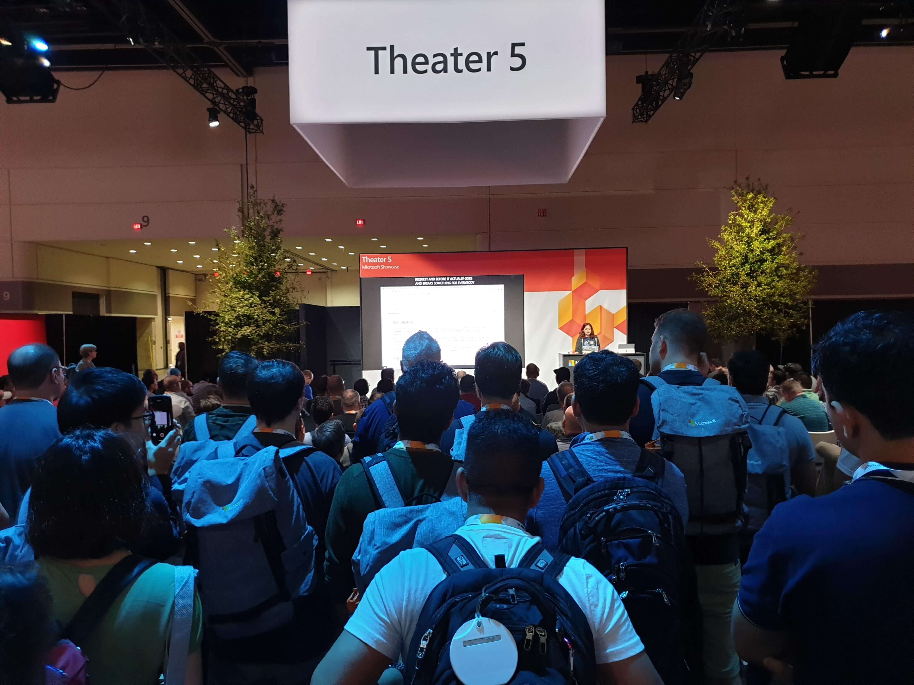

Most speaking advice is written for the kind of presentation you are likely to give at a conference, the kind I will call a "narrative talk". And yet, there is another kind of presentation altogether, the kind I will call a "customer presentation". If you are just starting out in Technical Sales or Developer Relations, you might think that these two are one and the same, but they are distinctly different.

Often times, when you are thinking to yourself “Wow, the presenter really sucks” it is because they are aiming for the wrong kind of talk. In my career, I have gone from Technical Sales to Developer Relations and back, and have given countless presentations. This post is the guide to the differences that I had to learn the hard way. 

If you come from DevRel and need to talk to customers, or just starting out in Technical Sales, this post is for you!

# Definitions
***Customer*** - large enterprise company with multiple stakeholders involved.

***Technical Sales*** - sales of technology that is so complex that it requires an engineer to have a full time job explaining it. 

***Narrative talk*** - a talk with a single narrative and a single story arc from beginning to end. This is the kind of talk typically given at conferences.

***Customer presentation*** - a talk given to a customer audience, usually to a set of known customer stakeholders. In Technical Sales, these presentations typically involve a deep dive into the technical aspects of your product, or a business-value conversation around it.

Note: the context of where you give each type of presentation is not absolute. You may (rarely) give a “narrative talk” to a customer, or a “customer presentation” at a conference (think of a technical breakout session). But the type of talk is distinctly different, and knowing which one you are aiming for is important.

# Talking at vs Talking with

The first and most important difference between the two is that in a conference talk, you are talking, and the audience is listening. It is not a conversation. If you have a 30 minute speaking slot, you should (ideally) speak for 30 minutes. 

It is not easy to keep the audience engaged for 30 minutes. It generally involves creating a good story arc that runs throughout the entire talk, and even some theatricals. There are lots of resources dedicated to improving speaking skills for a narrative talk. My favorites are the books “Talk like TED” by Carmine Gallo and “Presence” by Amy Cuddy.

A customer presentation ***is*** a conversation. 

Your goal for the presentation is to talk “with” the customer, not “at” them. Your talking points are an opportunity for the customer to dive deeper into what excites them, and skip over what they don’t care about. 

So what happens to the narrative then? Is there no narrative at all? Haven’t we been told that storytelling is the most important skill in sales? My answer is that the narrative should exist, but you should be flexible about it. In fact, customer presentation is more often a collection of narratives, which we will discuss in the Agenda section. 

Having a single narrative for a customer presentation can also backfire. I have seen many folks flop on customer calls because they were so committed to the narrative they’ve practiced, that they wouldn’t allow the audience to “distract” them, which completely misses the point. Nothing is less likely to help you sell your product than droning on with the pre-canned slides long past the point where anyone is interested. 

***In a customer presentation, if you’ve been talking for 15 minutes and no one else said a word, you are doing it wrong.***

# The Goal

The goal of a conference talk is to entertain and educate - in that order.

The goal of a customer presentation is… drum roll… to educate the customer and also learn as much as you can about the customer.

Wait, hold on! Isn’t the goal of a customer presentation to simply sell?!

It depends. If you are selling a subscription to the National Geographic magazine, and your customer can make a commitment right then and there to sign the check, then yes, the goal of the presentation is to “close the deal”. 

In enterprise Technical Sales, however, things do not happen so quickly. Things take time and require layers of approvals, weeks of proofs of concepts (POCs) etc. In my many years of experience, I have never seen the first customer presentation that was sufficient for someone to commit their entire organization to using a particular technology. 

Hence, the goal of the first conversation is to be the door opener. You want the customer to get excited enough to keep talking to you, to spin up a POC of your product, to become internal advocates for how your technology will solve their problems. And the easiest way to win people over is - surprise surprise - listening to them.

Ask questions. Lots of questions. Take notes.

Let the customer ask you questions. As many as they want. Whenever they want. (OK, if someone gets very disruptive, tell them to put it in the “parking lot”).

Scary, I know. They could ask you something you don’t know the answer to!

To quote Nancy Duarte, “... turn the conversation around, by letting them ask you questions. That’s a powerful way to reveal things on their mind you might never have thought of. People open up when they feel someone cares.”

And it’s always OK to say “I don’t know”, as long as you follow it up with “I will get back to you this week”. 

And then you do. Get back to them. This week.

# The Prep

The two most important points on the customer presentation preparation  are that:
- You never know what you are walking into.
- Even so, you should make an effort to prepare as much as possible.

Questions you must ask before the call:
- Who is the audience? How many people, their job roles, their levels of experience with your product. 
- What problem are they trying to solve?
- If they have used your product before, what questions / issues do they have.
- Questions about their tech stack (as appropriate in the context of your product).

You will never have all the time you wish you had to prepare. The technology landscape is vast, and every enterprise customer is a snowflake. Do your best to understand where the conversation is likely to go, and do your best to anticipate their questions. If you have a list of issues they’ve shared, research those. If they mentioned 3rd party products, give them a skim. You’ve got this.

Still, with all the prep, you never know what you are walking into. I have been in situations where we have done multiple pre-calls with customer stakeholders, and then walked into a conversation that was completely different from what was initially proposed. Any conversation about a product can easily turn into a conversation about the underlying platform, or the issues with the customer’s diverse tech stack, or integrations with 3rd party products you’ve never heard of. 

One example of being blindsided that is still stuck in my head was when “we want to talk about migrating applications to .NET Core” turned into a “we want a feature comparison of Azure AD with Auth0, and a review of Azure AD integration into our 20-year-old on-prem identity federation product.” I mean, I can improvise with the best of them, but even I have my limits...

Hold on, this is scary! How am I supposed to handle something I am totally unprepared for?!

You have 4 choices:

1. Keep going with the presentation you’ve prepared as if nothing happened. 

    This is the worst possible choice. The customer may even allow you to speak for an hour out of the kindness of their hearts, but they will be disappointed. Or they may throw rotten tomatoes at you. Either way, you aren’t getting what you came for.  

2. Admit that you are not prepared to handle the conversation they were expecting, and ask to reschedule. 

    It takes quite a bit of courage to admit that you don’t know all the things. Be proud of yourself for doing it! 
    Rescheduling is, unfortunately, way harder if you just spent 4 hours on a flight just getting to the customer location. If that's the case, maybe go for option 3.  

3. Admit that you are not prepared for the conversation they were expecting, and ask explicitly for a chance to have the conversation you planned.  
    As long as there is value in educating them on your originally planned topic, this could actually go well.   

4. Have the conversation they were expecting in your back pocket. 

Option 4 is truly a fantastic option. If there are other conversations that you can reasonably anticipate branching into, do some prep work for these. I promise you, it feels really good to say: “Oh, so you wanted to talk about storage and not networking. Well, let me just pull that up!”

Of course, no one has infinite time, or can anticipate all possible conversations. So option 4 usually only happens after a year or two of selling the same product, when you build a roster of potential conversations from prior customer calls. 

I have seen sales training that explicitly tells you to stick to your scripts. This might be good advice for Account Executives, but it is a bad idea for Solutions Architects. The title “Solutions Architect” signifies the goal of understanding the customer’s business cases, becoming a “trusted advisor”, and creating customized solutions for the customer. 

Being flexible is scary, and that is why so many folks cling rigidly to what they have rehearsed. But if you aren't interested in what problems your customer is trying to solve, how can you expect them to be interested in your technology?

# The Agenda

The agenda is another thing that differs from a narrative conference talk. 

In a narrative talk, you start with a “hook”, a short verbal or non-verbal action that will get your audience’s attention and convince them that listening to you is worth the time investment. An agenda is highly unlikely to be a good hook. 

In a customer presentation, especially a longer one, it is a great idea to start with an agenda.

Clarifying the agenda sets expectations for what the folks are getting themselves into, and which topics are going to be covered at what time (meaning that certain questions can be tabled until then). It also gives the audience a chance to “vote” by telling you that a certain sub-topic isn’t very interesting to them, so you can skip it, or cover it quickly. 

Good rules of thumb here are:

**Always start with getting intros from the main customer stakeholders in the audience.**

If the audience is very large, get at least an “we are 30% developer, 40% ops, 10% management” kind of intro. It is incredible how much you can tailor the message just by knowing who you are talking to.

**Always have a slide introducing yourself.**

Who are you? What is your prior experience? What makes you an expert on the subject? Unlike at a conference talk, the audience (hopefully) already wants to talk about the subject. The main goal of the intro slide is to show them why they should listen to _you_ on the subject. 

Show your battle scars if you can. Don’t just tell them you are a Linux person, make a joke about systemd. “We be of one blood, ye and I” is what you are going for. This is why your introduction should be _after_ the customer intros. 

I am also fond of setting expectations for what I am not an expert at. “I will walk you through creating a CI/CD pipeline for the data science project, but if you have questions about deep neural networks, I will bring Jane with me next time”. This is completely fair, and guides the future questions to the topics you actually want to talk about.

Another note is that some Technical Sales orgs are fond of bringing lots of people onto the customer call. if you brought ten people with you, you do not need to introduce them. You are risking losing the audience to their email forever.

**ALWAYS ask at least a couple of primary stakeholders in the audience what they are hoping to get out of the presentation.**

DO NOT make assumptions based on your previous prep. The people who showed up today could be a totally different group. Not knowing what the audience really hopes to learn is like shooting at a target blindfolded. 

Let’s now come back to the multiple narratives point. In a conference talk, your narrative is always a single story arc. Ok, if you are talking for 60 minutes, I would actually tell 3 substories that all play into a single big story arc, with some theatrical intermissions between them, because research shows that 18 minutes is roughly how long people can keep their attention on a single story (hence the length of a TED talk). 

In a customer presentation, each topic on your agenda is likely a different narrative. And this is actually a good thing. The customer team has multiple stakeholders who care about different aspects of your technology. Some of them may tune out during some parts of your presentation. That’s OK. 

Do not try to get a Node.js developer excited about CIDR notation. Instead, let them know when the topics they care about will be addressed.

***You do not need to win the entire audience over at the same time. You just need to win them all over by the end.***

## The Slides

How often have you heard that you shouldn’t have more than 40 words on a slide? And then you get the official corporate pitch deck for your product, and it has literally paragraphs of text in tiny font on each slide. What happened here? Are all the marketing people extremely bad at their jobs?

Of course not! What your slides look like depends on the goal your slideware is trying to accomplish, and here, again, there is a stark difference between a narrative talk and a customer presentation. 

This is a typical slide for me at a conference talk:

This, on the other hand, is an example of the executive summary slide from Nancy Duarte’s excellent book “DataStory: Explain Data and Inspire Action Through Story”:

Why the difference? The second slide is not just a presentation, it is a Slidedoc.

Per Duarte: “A Slidedoc is a visual document designed for quick consumption. It is intended to be read and distributed versus presented.” 

Most of the marketing pitch decks are Slidedocs. 

OK, but I am presenting the slides, not sending them over for the audience to read. Should I change them?

Some folks suggest building two versions of your presentation, one for presenting, and the other for people to read on their own time. I don’t disagree with the idea, but it is A LOT of extra work. The primary argument for rewriting the slides is that you lose people’s focus because they stop listening to you and start reading the slide. The truth is that most marketing slides are fine precisely because the font on them is so small that people cannot even try to read them. 

The main purpose of a slide in a customer presentation is to give you, the presenter, the reminder you need to talk through a particular topic. If it does so with few words and an easy to understand visual - great! But even if it is really a slidedoc with tiny fonts, it will work, as long as you know how to talk through it. 

# The Bottom Line

Most of the speaking advice out there pertains to giving narrative talks. These tend to be all about speaker storytelling. 

Customer presentations are very different; they are all about starting a conversation. In a customer presentation, you are using your slides to start a discussion. The difference in the presentation goal influences how you structure and deliver your talk.

Whew, you made it to the end of a long post! You deserve a cookie! 

If you have questions or comments, feel free to reach out on Twitter, I am [@DivineOps](https://twitter.com/DivineOps).

