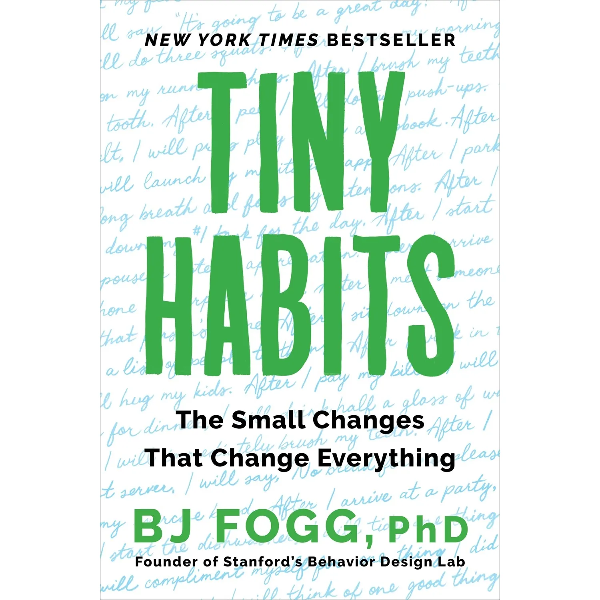
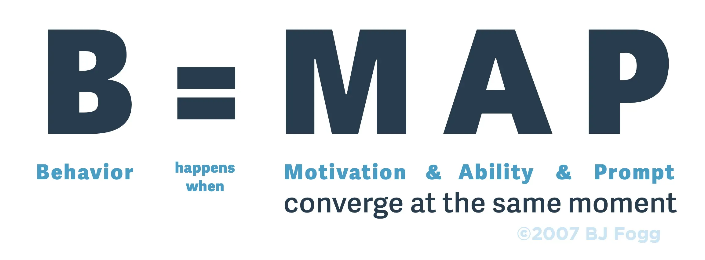
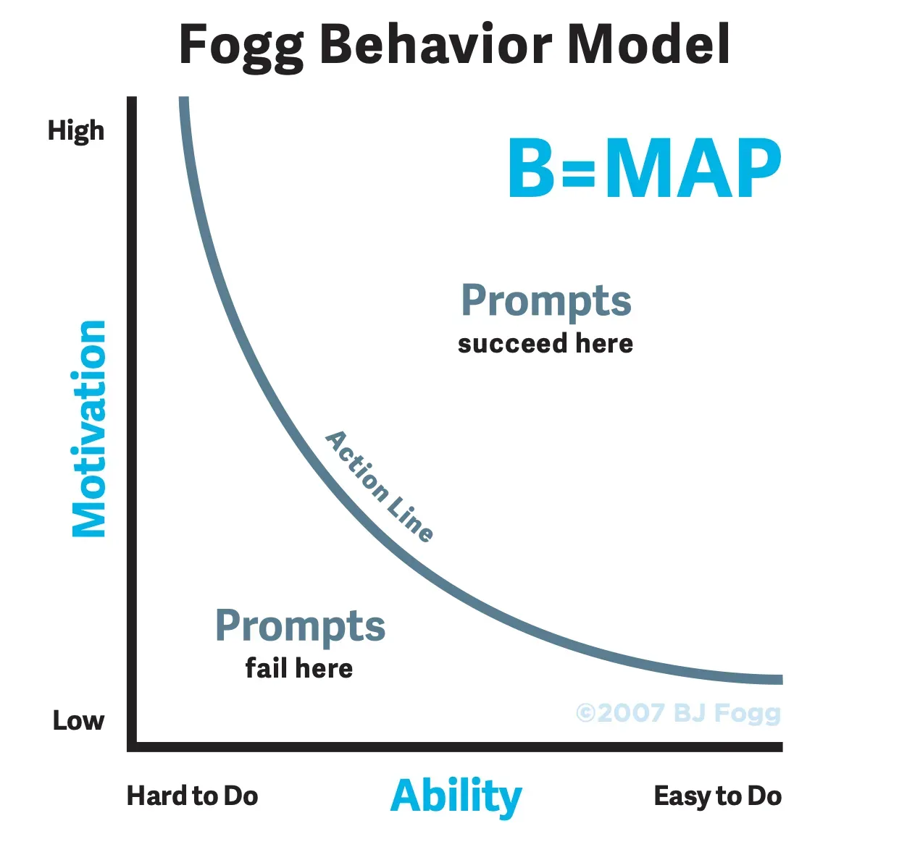

I have always been fascinated by what BJ Fogg calls "behavior design" and have read quite a few books on it - *The Power of Habit*, *Atomic Habits*, *Nudge*, Allen Carr's *The Easy Way to Control Alcohol*. So far, none came closer to giving me the feeling that I am “hacking the source code” of my own behavior than BJ Fogg’s *Tiny Habits*.

I found lots of good ideas in the book, including two that are causing me to look at human behavior in a new way. The kind of ideas I call ***revelations***

First, the premise.

# B = MAP
According to Fogg, behavior can be expressed as a simple formula.

By now you may have encountered the idea that behavior happens when motivation meets ability and prompt.

Here is a **revelation**: when debugging behavior, we are approaching it in the **wrong order**. 

How could I possibly know in what order _you_ approach debugging behavior?

I have lived in 3 different countries with very different cultures. In every single one, the common wisdom is that to change behavior, you need to affect motivation. Whether you are trying to influence yourself, your team at work, or your child, the primary strategy is to offer either a carrot (a reward) or a stick (a punishment) to increase someone’s motivation to do the behavior. 

If you've ever struggled to start a habit of exercising daily, or get your team at work to write Unit Tests, or influence your child to clean their room, you know from experience that this strategy doesn't work very well.

Worse than that, we escalate from labeling an action, to labeling a habit, to labeling someone's identity very fast. How quickly does your personal self-talk go from “I didn’t exercise today” to “I can never get myself to exercise” to “I’m a lazy piece of garbage”? The further you go down this path, the harder it is to come back.

# The Action Line
Dr. Fogg suggests explaining the relationship between the three elements of behavior using the Action Line graphic.

Notice the asymptotic tails. The easier the behavior is to do, the less motivation you need to do it. The higher your motivation, the harder you will be willing to work to do the behavior.

Motivation, however, is a fickle mistress. A much better strategy, researched by BJ Fogg and other scientists, is to start debugging the behavior at the other end of the B = MAP formula. 

There are a lot more details, examples, and suggestions in the book that I could never do justice to in a short blog, but here is the gist:

1. Can’t get yourself to start the desired behavior? Design a good **prompt**. 

Design a prompt that matches the *location*, *time*, and *context* of the behavior. (For example, if you get a reminder to start the dishwasher when you aren't even home it will likely end up being useless and even frustrating) Fit the prompt into your existing routine, try anchoring it to the end of an existing behavior. Often, this is all it takes.

2. Next up is **ability**.

Do you have a great prompt, but are still unable to do the behavior? Increase your physical or mental ability to perform it. Don’t trust yourself to overcome hurdles. Purposefully remove all friction. And, I mean, *all* friction. Make it easy to do the right thing. 

This is also where the habits being “tiny” comes in. 

It is a lot easier to do a single wall push-up than 20 good form floor push-ups. Dr. Fogg suggests that you should aim for the “tiny” core habit that you could execute on your very worst day, a day when you have a toothache, a work deadline, and your house is on fire. If you are still able to do the behavior on your worst day, you will usually be happy to do an enhanced version of the same behavior when you have the time and energy. 

# Celebration

Only the very best books leave me with more than one revelation, and *Tiny Habits* is one of those. 

As useful as the B = MAP formula has been, the most significant idea in the book for me is the importance of **celebration**. 

BJ Fogg points out that as adults, we tend to never celebrate our everyday successes. Worse than that, we dismiss our accomplishments with the mental track of “finally,” or “this is barely good enough,” or "I should have done this a week ago.”

According to Fogg’s research, the key to anchoring the new behavior is celebrating success. Every time you do the desired action, no matter how small it seems, celebrate. Spend a moment **authentically** congratulating yourself on accomplishing a goal (the importance of creating an authentic positive feeling immediately after the behavior is emphasized in the book). 

Seems silly or undeserved? 

Imagine you were training a puppy to sit on a sit command. What would happen if instead of giving it a treat for sitting down, you punished it for “not sitting well enough?” I bet the puppy would avoid the behavior like the plague. 

But this is exactly what you do to your “lizard brain” when you tell yourself “I’m just phoning it in” after doing a wall push up. At the end of the day, we are simple creatures. If we get discouragement for the wall push up, we aren’t going to take on the harder versions of the habit. 

Just as with the behavior debugging sequence, the common cultural approach seems to be quite wrong here. Humans are already naturally inclined to give negative reinforcements more often than positive ones. On top of that, we are taught that we can somehow “spoil” people by giving too much positive feedback. 

One of the quotes I've been using a lot since reading the book is “I change best by feeling good, not by feeling bad.” 

# A Personal Experiment
After reading the book, I decided to take the idea of celebration a bit further than habit hacking.

My personal and professional life has been quite stressful since the beginning of the pandemic, as I know it has been for so many folks. Usually an optimist, I've been feeling burnt out and overwhelmed. Absolutely everything, from writing an email to making a plate of scrambled eggs felt like another dreadful chore. 

I have decided to test what happens if I celebrate every positive behavior I do, be it a one-time thing or a habit, at work or at home, no matter how tiny. Unlike buying yourself a reward dinner, **authentic celebration** is free, always accessible, and comes with no extra calories. What’s the worst that could happen?

It’s been a few weeks since I’ve finished the book, and I can attest to feeling a lot less burnt out. Somehow, it is a lot easier to wipe off the dinner table if you give yourself a pat on the back for doing it. Somehow, everything in life feels lighter and more fun if you celebrate the tiny positive outcomes. 

Try it. See if it works for you.

As Aristotle said, "we are what we repeatedly do." I wish you luck on the journey of designing life through behavior design!


*Interested in seeing more posts like this? Please let me know on  or *

