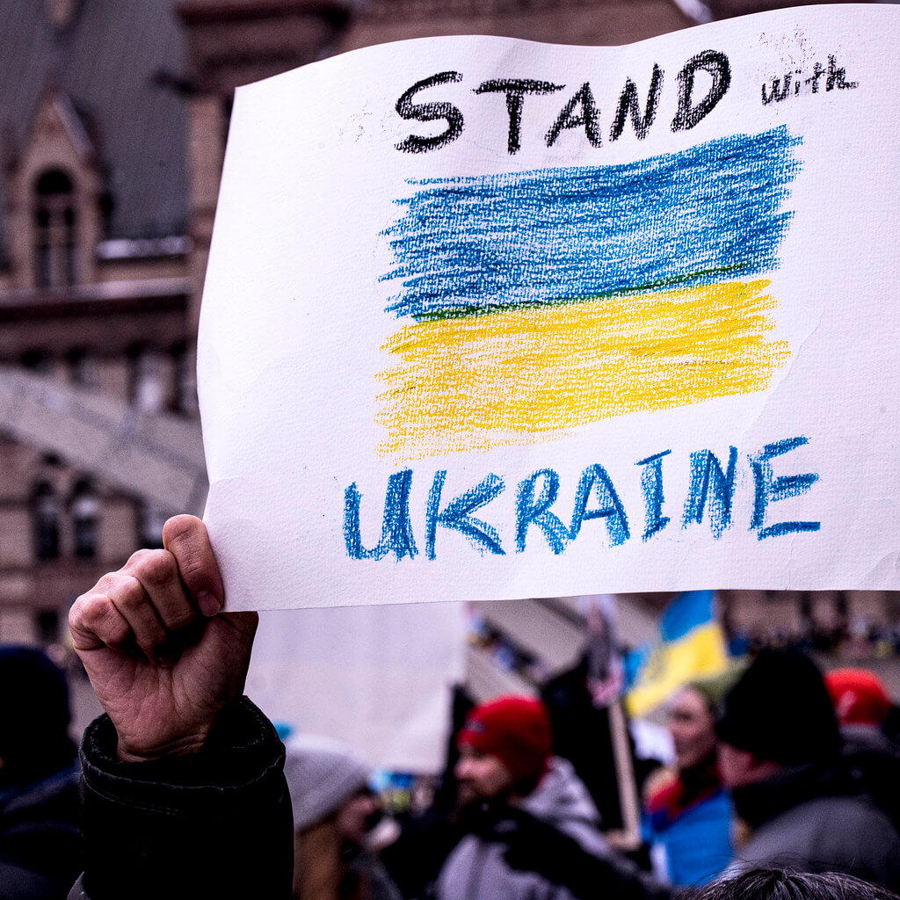
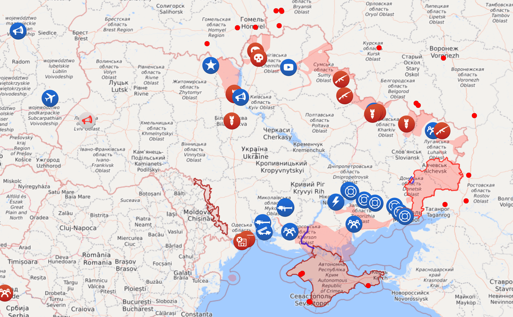

 <a style="font-size: small;" href="https://www.flickr.com/photos/mmmswan/51909048430">Image by Michael Swan</a>

This post is my voice, my personal view of the current situation in Ukraine. Even though I am personally safe, I am experiencing some degree of fear posting these words. I am free to speak my mind because I live in a democratic country, and I don't have close relatives in Russia who could be threatened to silence me. Many of my friends are not so lucky.

**Quick Links**

1. [What is happening](#what-is-happening)
1. [How you can help](#how-you-can-help)
    * [Donate](#donate)
    * [Speak Up](#speak-up)
    * [Ask your company to support Ukraine](#ask-your-company-to-support-ukraine)
    * [Ask your government to support Ukraine](#ask-your-government-to-support-ukraine)

# What is happening

As of today, the Russian military is leading an all-out war on Ukraine. They have invaded Ukraine on [multiple fronts](https://en.wikipedia.org/wiki/2022_Russian_invasion_of_Ukraine#24_February), and are [bombing cities all over the country](https://en.wikipedia.org/wiki/List_of_military_engagements_during_the_2022_Russian_invasion_of_Ukraine). Russia is using [Belarus as a base and is aided by Belarusian troops](https://kyivindependent.com/national/sources-belarus-to-join-russias-war-on-ukraine-within-hours/).

[Civilian targets](https://www.washingtonpost.com/world/2022/03/01/ukraine-russia-babyn-yar/) all over Ukraine are under fire. People spend days in [makeshift bomb shelters](https://www.npr.org/2022/02/28/1083421199/those-who-havent-fled-ukraine-hunker-down-in-make-shift-bomb-shelters). [Civilians are killed](https://www.theguardian.com/world/2022/mar/02/children-teachers-civilian-casualties-of-the-ukraine-conflict). (You can click on the map below to go to the live updated site)

Even with many [EU borders open to Ukrainian refugees](https://www.washingtonpost.com/world/2022/02/27/ukraine-refugees-photos-videos/), most people cannot flee the country.

There are Over 40 million people in Ukraine. 40 million people under fire.

*As I write these words, I am terrified that at any moment Putin may win. If he does, my friends and family might be killed or jailed, and I will have no means of helping them. If he does, I can never again visit the places where I or my family were born*

**Putin's goal is a new Soviet Union**

This war is much bigger than a single country invasion.

In his [speech](https://www.vox.com/policy-and-politics/2022/2/23/22945781/russia-ukraine-putin-speech-transcript-february-22) prior to the invasion of Ukraine, Putin said that the break of USSR was "the greatest geo-political catasrophe or the 21 century" and that he wants the NATO borders back at the 9X level.

Leaked information suggests that Putin intends to instate a puppet pro-Russian government over Ukraine. If he succeeds, there will no longer be anything that the West can do to stop him from forming a new version of USSR.

**The world leaders are abandoning Ukraine to fight alone**

[Putin is holding the world hostage with his finger on the nuclear button.](https://www.cnn.com/europe/live-news/ukraine-russia-putin-news-03-05-22/h_7131cef7390306e36e10475da7d4cf30)

NATO has the power to create an iron dome above Ukraine, preventing air strikes. NATO has the technology to deter or disorient Russian attackers without deploying a single soldier. As Gary Kasparov points out in [this thread](https://twitter.com/Kasparov63/status/1499439820363468802?s=20&t=GrmEmsXk8i1tWl8HPphBbw), there are many actions NATO allies can take to support Ukraine that do not involve boots on the ground. 

Yet NATO is doing NOTHING.

The West is using Ukraine as a live shield, letting Ukrainian women and children die. All the articles published on why NATO isn't creating a no-fly zone over Ukraine can be roughly summarized as ["NATO is afraid of Russia"](https://abcnews.go.com/International/ukraine-fly-zone-option-experts/story?id=83164297)

History shows us that dictators don't stop while winning. If the world does nothing to save Ukraine, what's to stop Putin from using the same nuclear threat to invade Latvia, Lithuania or Estonia, Georgia or Kazakhstan, or any other of the former USSR republics?

**This is a broken promise**

When the Soviet Union broke down, Ukraine had its own nuclear weapons. These weapons were dismantled under a guarantee of the United States, the United Kingdom, Russia, et al to [peace in Ukraine](https://theintercept.com/2022/02/27/ukraine-nuclear-weapons-russia-invasion/).

I was there. A family friend was working as a translator for the American workers in Dnipro whose job it was to oversee the disarmment. I think even as a kid I questioned if anyone would really come to aid us if we were under attack. I never once thought that the attack would be by our brothers and sisters...

**Ukraine cannot hold against Russian and Belorussian military without help**

The world leaders keep giving inspirational speeches about the tough people of Ukraine.

No matter how tough Ukrainians are, or how committed they are to their freedom, they do not have enough human resources, funds, or military equipment to hold off Russia and Belarus joint invasion.

Economic sanctions will not save Ukraine today.

**Putin isn't Russia**

There are many people in Russia who support Putin's agenda. The levels of state propaganda in both Russia and Belorus are such that many ordinary citizens believe that Russians are invading to "liberate" Ukraine.

Still, there are many people in Russia who do not support Putin, or this war.

Many of my friends who oppose the war are afraid to speak up, afraid to go to protests, afraid to post on social media due to risk of prosecution. Russia is almost at the former USSR level of freedom of speech supression. Russian authorities are [arresting children for laying flowers at the Ukrainian embassy](https://www.vice.com/en/article/y3vxyk/russia-police-arrest-children-ukraine-protest). [Prosecuting civilians for speaking out against the war](https://news.artnet.com/art-world/russian-cultural-workers-call-for-putins-resignation-2079442). The last remaining [independent media, Dozhd (TV Rain) and Ekho Moskvy has been shut down over the Ukrainian conflict coverage](https://www.vice.com/en/article/v7dx5x/russian-media-dozhd-tv-shutdown).

Even those who aren't in Russia are keeping quiet because their families are begging them to. Do you ever wonder what it would be like to fear an arrest over speaking up? Over someone else in your family speaking up?

**Do not let history repeat itself**

The longer the war continues, the more Putin consolidates his power in Russia. As the ountry isolation escalates, Putin will face mounting internal pressure to stop the war. The only way he can remain in power is by squishing dissent. 

Russia has just passed another law to imprison [reporters covering the war](https://www.cbsnews.com/news/russia-ukraine-news-war-journalists-prison-sentences/). Russia already has laws against [public demonstrations](https://www.pressherald.com/2022/02/25/russian-authorities-arrest-hundreds-of-protesters-as-anti-war-demonstrations-grow/) and ["disrespecting the government"](https://www.bbc.com/news/world-europe-47488267) that are used to jail ordinary citizens.

History has seen this playbook many times before. The opposition in sent to jails. The unscrupulous aids who are willing to murder and imprison their own brothers rise to power. 

The more war crimes are committed, the easier it becomes to commit even more atrocities. 

The longer Putin remains in power, the more totalitarian the entire Russian government will become. And this is the government holding the nukes over everyone's head.

# Why you should care

You are in North America, Europe, or Asia, your family is safe and Putin isn't at your door. Why should you care?

1. Innocent people are dying
2. If Putin succeeds at reinstating USSR, the Western world will be facing an isolated, volatile leader with access to Nuclear weapons for the foreseable future
3. History tells us that dictators do not stop while winning

# How you can help

Please don't walk away. Do something right now, however little, to support Ukraine.

## Donate

1. If you personally know people or organizations in Ukraine, please donate directly to them. Many civilians need help, and hundreds of new volunteer organizations created over the past 10 days need financial resources. It will take time for any other funds to reach them, so if you personally know folks who need help please help directly.

2. If you are able, please donate to Ukraine's Armed Forces (first link below). It is not possible for public companies and volunteer organizations to donate to military, but they can donate to humanitarian aid. But Ukraine cannot hold without its military. Hence, please encourage your company to donate to humanitarian aid, and use your personal funds to donate to military. 

***National Bank of Ukraine Armed Forces Fund***

Ukrainian armed forces are lacking basic equipment, clothing, weapons, food. The only way Ukraine can hold is by reinforcing the military. The NBU had spun up a special fundraising account for Ukrainian armed forces which is open to PayPal donations and wire transfers. [Donate to NBU here](https://bank.gov.ua/en/news/all/natsionalniy-bank-vidkriv-spetsrahunok-dlya-zboru-koshtiv-na-potrebi-armiyi).

***Humanitarian aid charities***
[Nova Ukraine](https://novaukraine.org/donate/) - A non-profit organization dedicated to raising awareness about Ukraine in the US and throughout the world and providing humanitarian aid to Ukraine.

[Razom for Ukraine](https://razomforukraine.org/donate/) - Razom, which means “together” in Ukrainian, believes deeply in the enormous potential of dedicated volunteers around the world united by a single goal: to unlock the potential of Ukraine.

Both of these are registered 501(c)(3) organizations, which are tax-exempt in the US. Both are registered with Benevity - you can check if your company offers a donation match.

***Additional verified donation links***

[Help Ukraine Win](https://helpukrainewin.org/) - By air, land, and sea, Russia has launched a devastating attack on Ukraine,
a European democracy of 44 million people. Help us stop Russian aggression!  How you can help as a foreigner.

[Support Ukraine Now](https://supportukrainenow.org/) - Real ways you can help Ukraine as a foreigner, Official funds, requests, materials (doc updated live, hourly).

## Speak up

Stay informed. Share verified information on social media. Go to pro-Ukrainian rallies. Carry a Ukrainian flag.

You can follow English-language sources such as [Kyiv Independent](https://twitter.com/KyivIndependent), president [Volodymyr Zelensky](https://twitter.com/ZelenskyyUa), and others on [this list](https://twitter.com/i/lists/1497538910792130560) to stay informed.

Your support matters.

Every one of my Ukrainian friends, both those in Ukraine who are under fire, and those who are currently in other countries has shared that they feel that the world has abandoned us.

Your support matters.

## Ask your company to support Ukraine

Companies can help in many ways, from matching donations, to ceizing business with Russia, to donating funds, to employing Ukrainians.

[GitHub is taking a brave action to support Ukraine](https://github.blog/2022-03-02-our-response-to-the-war-in-ukraine/). Reach out to your company leadership and ask them to follow suit.

Some geo-political situations are morally ambiguous. Not this one. Ask your company to be on the right side of history.

## Ask your Government to support Ukraine

Please feel free to use this [Template Letter to Government Representative](https://docs.google.com/document/d/1V2iMwRNEcS7zL5eNwbOeFZXFQiDBykfx93QaxRSrJlw/edit?usp=sharing)

There are many, many things Western countries can do to defend Ukraine. Please find your local government official and

- Ask them to create a no-fly zone over Ukraine
- Ask them to accept the [Ukrainian membership application to the EU](https://www.nationalturk.com/en/ukraine-applies-for-eu-membership/)
- Ask them to [support Ukraine in joining NATO](https://www.businessinsider.com/ukraine-is-not-a-nato-member-what-it-takes-to-join-2022)
- Ask them to help Ukraine with funds, armor, weapons, food and supplies.
- Ask them to aid Ukraine with troops.
- Ask that they freeze Russian funds and assets.

If you’re in the US you can use the [weStandWithUkraine](https://supportukrainenow.org/influence-authorities-directly) bot on Telegram to find your local representatives and how to communicate with them.

You can also read the [post by the DevOpsDays](https://devopsdays.org/blog/2022/03/02/devopsdays-stands-with-ukraine/) organization, with more information and resources provided in large part by the DevOpsDays Kyiv community.

In May 2019, me and a number of technical folks from all over the world were in Ukraine to speak with the Ukrainian technical community at DevOpsDays Kyiv. If Putin wins, none of us can step foot in Ukraine ever again. If Putin wins, none of us can work with the Ukrainian tech community members ever again. If Putin wins, our brave friends in the DevOpsDays, Kubernetes and other technical communities may be jailed or killed for fighting the Russian invasion.

Please help me save my home.

